# Pokémon Mystic Crystal

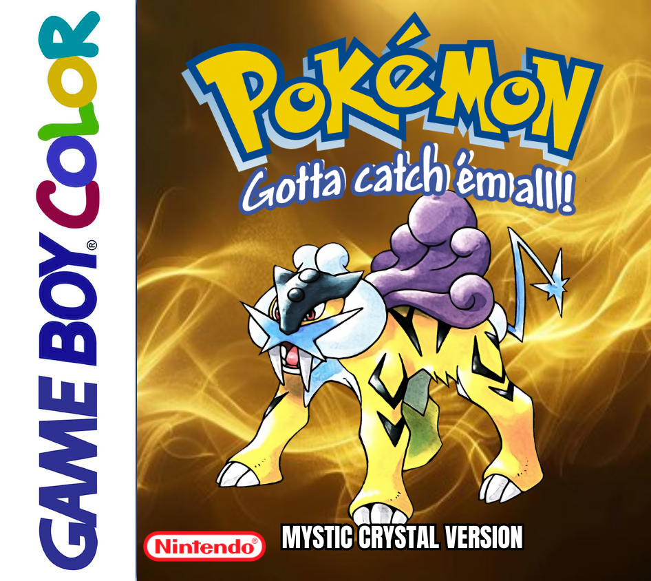

This is a Pokemon Crystal hack based on the pokecrystal disassembly from pret.

In this hack, you will see an expanded/modified Johto, with a focus on the more traditional aspects of the region.
So if you are a sucker for traditional buildings, pagodas, shrines, and forests, this is your hack. 
# WARNING: The game may not follow canon.

# IMPORTANT!
To patch, use the Pokemon Crystal 1.0 (aka "original crystal) ROM (not Rev 1 or 1.1). 

To play, please use SameBoy, BGB, PizzaBoy C, or mGBA. Other emulators may not be compatible with the game and will probably cause issues.

Join the Discord for updates and more information: https://discord.gg/RrN7BFXs7d

# Features: 
1. There are new areas/cities (more are currently being added).
2. You can rematch gym leaders as many times as you want. Just speak to them right after winning (currently you can re-battle up to Pryce).
3. Pokemon trainers, leaders, Elite Four, and wild pokemon have higher levels. This is to offer a more challenging experience, without entering Kaizo or "difficulty hack" territory.
4. You can catch all starters from Johto and Kanto. 
5. The Celebi event was restored.
6. Each pokemon has a unique icon associated with it instead of the generic ones from vanilla games.
7. You don't get the Silver Wing the same way as in Vanilla. HINT: You get it in one of the new areas.
8. There is a tradeback NPC in one of the new areas. HINT: This person says he can make your pokemon travel through time. 
9. Raikou is no longer a roamer. Raikou is found somewhere else. I am confident you will figure it out. Entei is also a static encounter somewhere. Good luck!
10. In vanilla games, many Johto pokemon were only available post-game in Kanto, which was absurd. Now you can get them relatively earlier in Johto.
    a) The same is true of some Kanto pokemon. For example, Diglett, which you can find early in Johto now.
11. Viridian forest, Cinnabar volcano, Seafoam cave, Power plant ruins, and the safari zone in Fuchsia city were added to the game. Additionaly, the 11 floors of the Silph Co., as well as the Pokemon Mansion in Cinnabar Island, are available with items and trainers.
12. There is a person in the Goldenrod Dept. Store who sells evolution stones.
13. Physical/special split.
14. Fairy type.
15. TMs are infinitely reusable.
16. Exp. points from catching pokemon.
17. No gym badge boosts.
18. Added a "toggleable" Exp. Share key item that gives exp. points to party.
19. Removed the 25% failure rate for enemy status moves.
20. Exp share only gives 25% experience to inactive pokemon.
21. Pokemon pictures in the overworld now have color instead of being grayscale.
22. Created more blocks to edit the appearance of some of the vanilla maps.
23. Fixed AI battle bugs.
24. Fixed apricorn ball bugs.
25. Fixed rival "low DVs" bug.
26. Fixed bug preventing status from affecting catch rates.
27. Improved AI battle system according to Pret tutorial.
28. Added running shoes.
29. Expanded tiles to 256.
30. Kurt finishes apricorn balls immediately.
31. Berry trees can give multiple berries now.
32. Added a pocket PC (called "laptop" within the game). This cannot be used in the Forbidden Palace or in the Elite Four.
33. Changed the types and stats for several pokemon to be like those in Pokemon Polished Crystal. For example, Feraligatr is water dark, Typhlosion is fire ground, and Meganium is grass fairy.
34. Added color to badges.
35. Moonblast is a new offensive fairy-type attack.
36. Many areas now have night music.

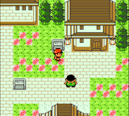
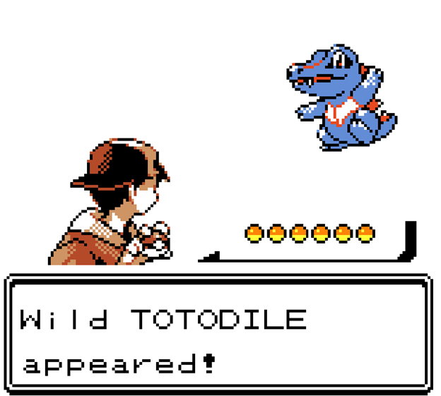
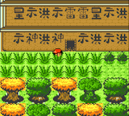
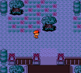
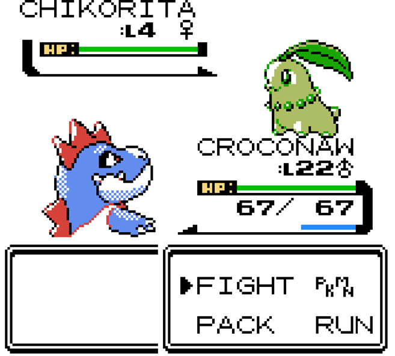
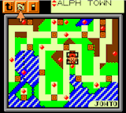
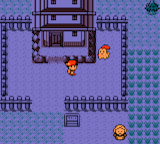
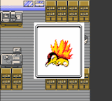
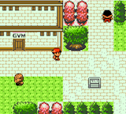
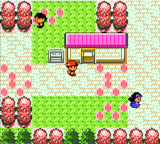
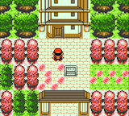
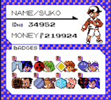

CREDITS: 
1. To the pret team who made this and many more projects possible by creating the disassemblies. Thank you all. 
2. Meta, the ROMhack youtuber, for giving me the idea of putting Totodile as a wild pokemon in a certain location (check out his wonderful chanel: https://www.youtube.com/@metaphysical8698
3. To Discord user Censoredharp, who gave me the idea of putting Diglett somewhere early in johto. This was a good idea.
4. Thanks for "Mmmmmm" who demixed the Pokemon XY Frost Cavern song and the Black City song, and to Vulcandth from the Polished Crystal team who also made contributions to this soundtrack. In addition, thanks to FroggestSpirit for the Cinnabar island, Pokemon Mansion, and Cerulean cave music.
5. Thanks to French Orange for providing tilesets of all kinds. Here is the DA page: https://www.deviantart.com/frenchorange/art/Pokemon-Gold-and-Silver-SW97-Tileset-948665568
6. If I missed someone else, please let me know.
7. Tom Wang for Chris' running sprite, and Seasick for Kris' running sprite.

The following links are associated with pret only, not my hack per se:
You can find pret on [Discord (pret, #pokecrystal)](https://discord.gg/d5dubZ3).

For other pret projects, see [pret.github.io](https://pret.github.io/).
[docs]: https://pret.github.io/pokecrystal/
[wiki]: https://github.com/pret/pokecrystal/wiki
[tutorials]: https://github.com/pret/pokecrystal/wiki/Tutorials
[symbols]: https://github.com/pret/pokecrystal/tree/symbols
[tools]: https://github.com/pret/gb-asm-tools
[ci]: https://github.com/pret/pokecrystal/actions
[ci-badge]: https://github.com/pret/pokecrystal/actions/workflows/main.yml/badge.svg
